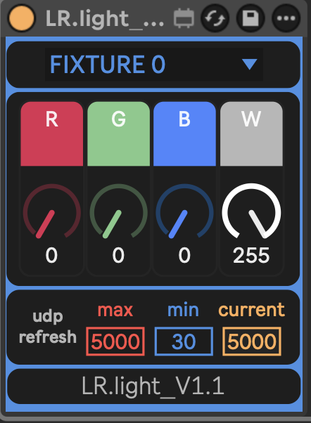
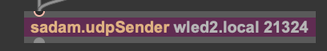
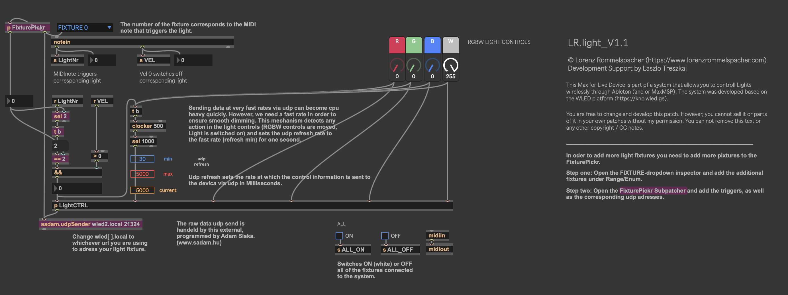

# Max for Live Device Guide

This guide explains how the **LR.light Max for Live device** works, how to use it in Ableton Live, and how to customize or extend it as needed.

  
*Figure 1: LR.light Max for Live device interface*

---

## How It Works

The LR.light device sends **RGBW color data** from Ableton Live to your LED fixtures over **UDP**, using the [`sadam.udpSender`](http://www.sadam.hu/en/software) Max external. Data is sent continuously to prevent WLED from falling back to its default state.

---

## Controls

### RGBW Dials

The four main dials at the top of the device control the **Red**, **Green**, **Blue**, and **White** channels of your LED strips. Each dial ranges from `0` to `255`.

- These values are sent to the **entire fixture** — not per-pixel (yet).
- Brightness is controlled via the **dials themselves** (no global dimmer).
- Because of the minimal aesthetic of most LR.light use cases (eg. my own artistic projects), **White** is usually the only channel actively used.

### Light Triggering (Gate)

Lights are turned **on/off** using **MIDI notes**, which function like a gate:

- **Gate opens** → light turns on (using the current RGBW values)
- **Gate closes** → light turns off (sends 0 to all channels)

You can trigger the gate via:
- MIDI clips
- MIDI controllers
- Any other MIDI event Ableton Live supports

**Note → Fixture Mapping:**

- `MIDI Note 0` → Fixture 0  
- `MIDI Note 1` → Fixture 1  
- etc.

> ⚠️ Make sure each note only triggers one fixture at a time to avoid collisions.

---

### UDP Refresh Rate

Below the RGBW dials, you’ll find controls for **UDP refresh rate**:

- **MIN:**  
  Default is `30ms`.  
  A lower value ensures smooth transitions (e.g. fades), without visual stepping.

- **MAX:**  
  Default is `5000ms` (5 seconds).  
  This reduces network load and processing when nothing is changing.

> The device automatically switches to **MAX refresh rate** after **0.5 seconds of inactivity** (no user input).  
> This helps avoid bandwidth overload — especially with multiple fixtures and high-resolution LED strips (e.g. 144 RGBW LEDs = 576 values per update, per fixture).

---

## UDP Sending – `sadam.udpSender`

  
*Figure 2: sadam.udpSender object in Max patch*

The device uses [`sadam.udpSender`](http://www.sadam.hu/en/software) to send **raw UDP data** (non-OSC) to each fixture. This is necessary because Max's native `udpsend` does not support this format.

- The **address** used in `sadam.udpSender` must match the **mDNS hostname** set in your WLED fixture.  
  For example: `wled0.local`, `wled1.local`, etc.

- The **port number** must be `21324`  
  This is hardcoded in WLED and **must not be changed**.

---

## Fixture Selection (v1.1 and later)

In **LR.light v1.1**, the device includes a **dropdown menu** for selecting which fixture to address.

- The dropdown automatically sets the correct hostname internally
- This removes the need to manually edit the patch for each fixture

> ⚠️ This feature is currently **untested**. Use with caution.  
> If you need to modify the device, follow the original naming convention (`wled0.local`, `wled1.local`, etc.) or reprogram the `FixturePickr` logic according to our own naming convention.

---

## Patch Overview

  
*Figure 3: Full Max for Live device patch*

---

## Notes

- This device is designed for **simplicity and reliability in live performance**.
- It currently **does not support per-pixel control**, though WLED and the UDP protocol make that technically possible.
- You are encouraged to open the patch and modify it — all Max objects are documented and commented.

---

## Troubleshooting

- Make sure the **mDNS address matches** between the WLED fixture and the device
- If a fixture is missing or unreachable, Ableton may become unresponsive
- Keep your **UDP refresh rate** conservative when using many fixtures at once

